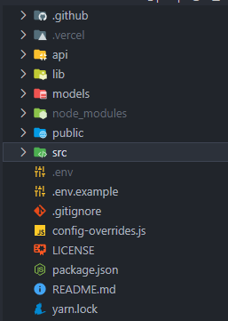

<a name="readme-top"></a>

<!-- PROJECT SHIELDS -->
[![Contributors][contributors-shield]][contributors-url]
[![Forks][forks-shield]][forks-url]
[![Stargazers][stars-shield]][stars-url]
[![Issues][issues-shield]][issues-url]
[![MIT License][license-shield]][license-url]

<!-- PROJECT LOGO -->
<br />
<div align="center">
  <a href="https://github.com/thisdot/blockchain-prediction-game">
    
  </a>

<h3 align="center">Blockchain Prediction Game</h3>

  <p align="center">
    This Project utilizes <a href="https://docs.chain.link/docs/solana/data-feeds-solana/#Solana%20Devnet"><strong>Off-Chain Chainlink Price Feeds</strong></a> to demostrates how to build a simple Prediction Game using Solana. This project works on both Solana Mainnet Beta & Devnet.
    <br />
    <a href="https://github.com/thisdot/blockchain-prediction-game"><strong>Explore the docs »</strong></a>
    <br />
    <br />
    <a href="https://blockchain-prediction-game.vercel.app/">View Demo</a>
    ·
    <a href="https://github.com/thisdot/blockchain-prediction-game/issues">Report Bug</a>
    ·
    <a href="https://github.com/thisdot/blockchain-prediction-game/issues">Request Feature</a>
  </p>
</div>

<!-- TABLE OF CONTENTS -->
<details>
  <summary>Table of Contents</summary>
  <ol>
    <li>
      <a href="#getting-started">Getting Started</a>
      <ul>
        <li><a href="#prerequisites">Prerequisites</a></li>
        <li><a href="#installation">Installation</a></li>
      </ul>
    </li>
    <li>
      <a href="#about-the-project">About The Project</a>
      <ul>
        <li><a href="#built-with">Built With</a></li>
        <li><a href="#context">Context</a></li>
        <li><a href="#file-structure">File Structure</a></li>
        <li><a href="#constraints-assumptions">Constraints & Assumptions</a></li> 
        <li><a href="#design-considerations">Design Considerations</a></li>
        <li><a href="#proposed-design">Proposed Design</a></li>
        <li><a href="#architectural-constraints">Architectural Constraints</a></li>
        <li><a href="#additional-considerations">Additional Considerations</a></li>
      </ul>
    </li>
    <li><a href="#contributing">Contributing</a></li>
    <li><a href="#acknowledgments">Acknowledgments</a></li>
  </ol>
</details>

<!-- GETTING STARTED -->
## Getting Started

This is an example of how you may give instructions on setting up your project locally.
To get a local copy up and running follow these simple example steps.

### Prerequisites

1. Setup `gh` on your machine
   ```sh
   npm install -g gh
   ```
2. Fork and clone the repo
   ```sh
   gh repo fork https://github.com/thisdot/blockchain-prediction-game.git --clone
   ```
3. Install the latest Mainnet version of the Solana CLI and export the path to the CLI:
  ```sh 
  -c "$(curl -sSfL https://release.solana.com/v1.9.28/install)" && export PATH="~/.local/share/solana/install/active_release/bin:$PATH"
  ```
Run `solana --version` to make sure the Solana CLI is installed correctly.
  ```sh
    solana --version
  ```
3. Install [Node.js 14 or higher][node.js-url]. Run `node --version` to verify which version you have installed:
  ```sh
    node --version
  ```
4. Setup vercel
   1. To install the latest version of Vercel CLI, run this command:
    ```sh
    npm i -g vercel
    ```
   2. To quickly start a new project, run the following commands:
    ```sh
    cd blockchain-prediction-game    # Change directory to the project
    vercel          # Deploy to the cloud
    ```
   3. Finally, [connect your Git repository](https://vercel.com/docs/git) to Vercel and deploy with git push.

### Installation

1. Run `cp .env.example .env`
2. Install NPM packages
   ```sh
   yarn
   ```
3. Create a temporary Solana wallet to use for this example. Alternatively, if you have an existing wallet that you want to use, locate the path to your [keypair][keypair-url] file and use it as the keypair for the rest of this guide.
   ```sh 
    solana-keygen new --outfile ./id.json
   ```
   Copy the contents of the array in `./id.json` to `WALLET_PRIVATE_KEY=` 
4. Setup MongoDB database
   1. Setup a Mongodb account via the following tutorial: [Create Mongodb Account](https://www.mongodb.com/docs/guides/atlas/account/). 
   2. Setup Mongodb cluster. [Create Cluster](https://www.mongodb.com/docs/guides/atlas/cluster/)
   3. Setup Mongodb User. [Create User](https://www.mongodb.com/docs/guides/atlas/db-user/)
   4. After the account has been setup get the connection url via this tutorial: [Get Mongodb Connection Uri](https://www.mongodb.com/docs/guides/atlas/connection-string/)
   5. Copy connection uri string to `MONGODB_URI=`
   6. Copy database name to `MONGODB_DB=`
   
5. Generate a random API key:  `https://generate-random.org/api-key-generator` and copy it to `API_SECRET_KEY=`
6. Finally, run the following command to start the application:
   ```sh
   yarn development
   ```

<p align="right">(<a href="#readme-top">back to top</a>)</p>


<!-- ABOUT THE PROJECT -->
## About The Project

<div align="center">
    
</div>


### Built With

* [![React][React.js]][React-url]
* [![Create-React-App][Create-React]][Create-React-url]
* [![Chainlink Solana Sdk][Chainlink]][Chainlink-url]
* [![Chakra UI][Chakra-UI]][Chakra-UI-url]
* [![Project Serum Anchor][Anchor]][Anchor-url]
* [![Solana/web3.js][Solana/web3.js]][Solana/web3.js-url]
* [![Solana Wallet Adapter][Solana-Wallet-Adapter]][Solana-Wallet-Adapter-url]
* [![Mongoose][Mongoose]][Mongoose-url]
* [![Vercel][Vercel]][Vercel-url]

<p align="right">(<a href="#readme-top">back to top</a>)</p>

### Context

The application shows you how to setup a simple game that allows its users to do the following:
1. Users can connect to solana wallet of choice (Solfare, Phantom etc.).
2. Users can stake solana based on predefined predictions 
3. The predictions state if the price of blockchain token pair will rise or fall below or above a certain price within a certain time frame (1hr). 
4. Users get a notification if they win the prediction.
5. Users are rewarded with double of their stake if their predictions are correct and allowed to withdraw these funds to their wallet.
6. Users can view the top 5 users based on the percentage of predictions won.

**Image of the system design**

<p align="right">(<a href="#readme-top">back to top</a>)</p>

### File Structure

<div align="left">
    
</div>

**Image of the File Structure**

The major folders for the application are as follows:
1. `.github` - This stores the application [github actions](https://docs.github.com/en/actions)
2. `api` - This stores the [vercel serverless functions](https://vercel.com/docs/concepts/functions/serverless-functions) that act as our backend.
3. `models` - This stores Mongoose Schemas
4. `lib` - This stores the MongoDB connection
5. `src` - This stores the `create-react-app` files
6. `config-overrides.js` - This file overrrides `webpack` configurations for `react-app-rewired`

<p align="right">(<a href="#readme-top">back to top</a>)</p>


<!-- CONTRIBUTING -->
## Contributing

Contributions are what make the open source community such an amazing place to learn, inspire, and create. Any contributions you make are **greatly appreciated**.

If you have a suggestion that would make this better, please fork the repo and create a pull request. You can also simply open an issue with the tag "enhancement".
Don't forget to give the project a star! Thanks again!

1. Fork the Project
2. Create your Feature Branch (`git checkout -b feature/AmazingFeature`)
3. Commit your Changes (`git commit -m 'Add some AmazingFeature'`)
4. Push to the Branch (`git push origin feature/AmazingFeature`)
5. Open a Pull Request

<p align="right">(<a href="#readme-top">back to top</a>)</p>


<!-- ACKNOWLEDGMENTS -->
## Acknowledgments

* []()
* []()
* []()

<p align="right">(<a href="#readme-top">back to top</a>)</p>


<!-- MARKDOWN LINKS & IMAGES -->
<!-- https://www.markdownguide.org/basic-syntax/#reference-style-links -->
[contributors-shield]: https://img.shields.io/github/contributors/thisdot/blockchain-prediction-game.svg?style=for-the-badge
[contributors-url]: https://github.com/thisdot/blockchain-prediction-game/graphs/contributors
[forks-shield]: https://img.shields.io/github/forks/thisdot/blockchain-prediction-game.svg?style=for-the-badge
[forks-url]: https://github.com/thisdot/blockchain-prediction-game/network/members
[stars-shield]: https://img.shields.io/github/stars/thisdot/blockchain-prediction-game.svg?style=for-the-badge
[stars-url]: https://github.com/thisdot/blockchain-prediction-game/stargazers
[issues-shield]: https://img.shields.io/github/issues/thisdot/blockchain-prediction-game.svg?style=for-the-badge
[issues-url]: https://github.com/thisdot/blockchain-prediction-game/issues
[license-shield]: https://img.shields.io/github/license/thisdot/blockchain-prediction-game.svg?style=for-the-badge
[license-url]: https://github.com/thisdot/blockchain-prediction-game/blob/master/LICENSE.txt
[product-screenshot]: images/screenshot.png
[node.js-url]: https://nodejs.org/en/download/
[keypair-url]: https://docs.solana.com/terminology#keypair
[React.js]: https://img.shields.io/badge/React-20232A?style=for-the-badge&logo=react&logoColor=61DAFB
[React-url]: https://reactjs.org/
[Create-React]: https://img.shields.io/badge/Create-React-09D3AC?style=for-the-badge&logo=create-react-app&logoColor=61DAFB
[Create-React-url]: https://create-react-app.dev/
[Chainlink]: https://img.shields.io/badge/Chainlink-375BD2?style=for-the-badge&logo=chainlink&logoColor=61DAFB
[Chainlink-url]: https://www.npmjs.com/package/@chainlink/solana-sdk
[Chakra-UI]: https://img.shields.io/badge/Chakra-UI-319795?style=for-the-badge&logo=chakra-ui&logoColor=61DAFB
[Chakra-UI-url]: https://chakra-ui.com/
[Anchor]: https://img.shields.io/badge/Anchor-5000B9?style=for-the-badge&logo=anchor&logoColor=61DAFB
[Anchor-url]: https://github.com/coral-xyz/anchor#readme
[Solana-Wallet-Adapter]: https://img.shields.io/badge/Wallet-Adapter-375BD2?style=for-the-badge&logo=web3.js&logoColor=61DAFB
[Solana-Wallet-Adapter-url]: https://github.com/solana-labs/wallet-adapter#readme
[Solana/web3.js]: https://img.shields.io/badge/Solana/web3.js-F16822?style=for-the-badge&logo=web3.js&logoColor=61DAFB
[Solana/web3.js-url]: https://github.com/solana-labs/solana-web3.js
[Mongoose]: https://img.shields.io/badge/Mongoose-47A248?style=for-the-badge&logo=mongodb&logoColor=61DAFB
[Mongoose-url]: https://mongoosejs.com/
[Vercel]: https://img.shields.io/badge/Vercel-000000?style=for-the-badge&logo=vercel&logoColor=61DAFB
[Vercel-url]: https://vercel.com/
