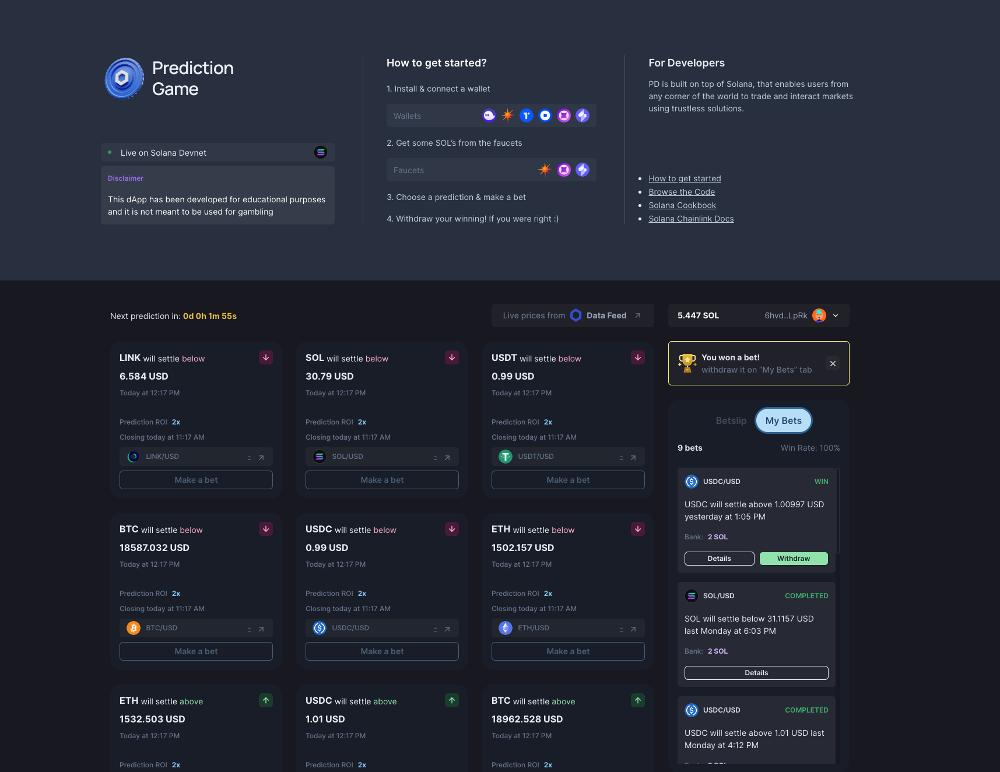

<a name="readme-top"></a>

<!-- PROJECT SHIELDS -->
[![Contributors][contributors-shield]][contributors-url]
[![Forks][forks-shield]][forks-url]
[![Stargazers][stars-shield]][stars-url]
[![Issues][issues-shield]][issues-url]
[![MIT License][license-shield]][license-url]

<!-- PROJECT LOGO -->
<br />
<a href="https://github.com/thisdot/blockchain-prediction-game">
  
</a>

# Blockchain Prediction Game

This Project utilizes [Off-Chain Chainlink Price Feeds](https://docs.chain.link/docs/solana/data-feeds-solana/#Solana%20Devnet) to demostrates how to build a simple Prediction Game using Solana. This project works on both Solana Mainnet Beta & Devnet.

[Explore the docs »](https://github.com/thisdot/blockchain-prediction-game)

[View Demo](https://blockchain-prediction-game.vercel.app/) · [Report Bug](https://github.com/thisdot/blockchain-prediction-game/issues) · [Request Feature](https://github.com/thisdot/blockchain-prediction-game/issues)

<!-- TABLE OF CONTENTS -->
<details>
  <summary>Table of Contents</summary>
  <ol>
    <li>
      <a href="#getting-started">Getting Started</a>
      <ul>
        <li><a href="#prerequisites">Prerequisites</a></li>
        <li><a href="#installation">Installation</a></li>
      </ul>
    </li>
    <li>
      <a href="#about-the-project">About The Project</a>
      <ul>
        <li><a href="#built-with">Built With</a></li>
        <li><a href="#context">Context</a></li>
        <li><a href="#file-structure">File Structure</a></li>
        <li><a href="#system-design">System Design</a></li>
        <li>
          <a href="#usage">Usage</a>
          <ul>
            <li><a href="#chainlink-data-feeds">Chainlink Data Feeds</a>
            <li><a href="#solana-wallet-adapter">Solana Wallet Adapter</a>
            <li><a href="#solana-web3.js">Solana/web3.js</a>
            <li><a href="#vercel-serverless-functions">Vercel Serveless Functions</a>
            <li><a href="#github-actions-and-cron-jobs">Github Actions and Cron Jobs</a>
            <li><a href="#mongodb-mongoose">MongoDB and Mongoose</a>
          </ul>
        </li>
        <li><a href="#constraints-assumptions">Constraints & Assumptions</a></li> 
        <li><a href="#additional-considerations">Additional Considerations</a></li>
      </ul>
    </li>
    <li><a href="#contributing">Contributing</a></li>
    <li><a href="#acknowledgments">Acknowledgments</a></li>
  </ol>
</details>

<!-- GETTING STARTED -->
## Getting Started

This is an example of how you may give instructions on setting up your project locally.
To get a local copy up and running follow these simple example steps.

### Prerequisites

1. Setup `gh` on your machine
   ```sh
   npm install -g gh
   ```
2. Fork and clone the repo
   ```sh
   gh repo fork https://github.com/thisdot/blockchain-prediction-game.git --clone
   ```
3. Setup Solana CLI
   1. Install the latest Mainnet version of the Solana CLI and export the path to the CLI:
   ```sh 
    sh -c "$(curl -sSfL https://release.solana.com/v1.9.28/install)" && export PATH="~/.local/share/solana/install/active_release/bin:$PATH"
   ```
   2. Run `solana --version` to make sure the Solana CLI is installed correctly.
   ```sh
    solana --version
   ```
4. Install [Node.js 14 or higher][node.js-url]. Run `node --version` to verify which version you have installed:
   ```sh
    node --version
   ```
5. Setup vercel
   1. To install the latest version of Vercel CLI, run this command:
    ```sh
    npm i -g vercel
    ```
   2. To quickly start a new project, run the following commands:
    ```sh
    cd blockchain-prediction-game    # Change directory to the project
    vercel          # Deploy to the cloud
    ```
   3. Finally, [connect your Git repository](https://vercel.com/docs/git) to Vercel and deploy with git push.

### Installation

1. Change to the project directory `cd blockchain-prediction-game`
2. Run `cp .env.example .env`
3. Install NPM packages
   ```sh
   yarn
   ```
4. Create a temporary Solana wallet to use for this example. Alternatively, if you have an existing wallet that you want to use, locate the path to your [keypair][keypair-url] file and use it as the keypair for the rest of this guide.
   ```sh 
    solana-keygen new --outfile ./id.json
   ```
   Copy the contents of the array in `./id.json` to `WALLET_PRIVATE_KEY=` in `.env`
5. Download a wallet extension on your browser, preferably [Phantom](https://phantom.app/download). Follow instructions to setup your wallet.
6. Setup MongoDB database
   1. Setup a Mongodb account via the following tutorial: [Create Mongodb Account](https://www.mongodb.com/docs/guides/atlas/account/). 
   2. Setup Mongodb cluster. [Create Cluster](https://www.mongodb.com/docs/guides/atlas/cluster/)
   3. Setup Mongodb User. [Create User](https://www.mongodb.com/docs/guides/atlas/db-user/)
   4. After the account has been setup get the connection url via this tutorial: [Get Mongodb Connection Uri](https://www.mongodb.com/docs/guides/atlas/connection-string/)
   5. Copy connection uri string to `MONGODB_URI=`
   6. Copy database name to `MONGODB_DB=`
   
7. Generate a random API key:  `https://generate-random.org/api-key-generator` and copy it to `API_SECRET_KEY=`
8. Finally, run the following command to start the application:
   ```sh
   yarn development
   ```

<p align="right">(<a href="#readme-top">back to top</a>)</p>


<!-- ABOUT THE PROJECT -->
## About The Project

<div>
  
</div>


### Built With

[![React][React.js]][React-url]
[![Create-React-App][Create-React]][Create-React-url]
[![Chainlink Solana Sdk][Chainlink]][Chainlink-url]
[![Chakra UI][Chakra-UI]][Chakra-UI-url]
[![Project Serum Anchor][Anchor]][Anchor-url]
[![Solana/web3.js][Solana/web3.js]][Solana/web3.js-url]
[![Solana Wallet Adapter][Solana-Wallet-Adapter]][Solana-Wallet-Adapter-url]
[![Mongoose][Mongoose]][Mongoose-url]
[![Vercel][Vercel]][Vercel-url]

<p align="right">(<a href="#readme-top">back to top</a>)</p>

### Context

The application shows you how to setup a simple game that allows its users to do the following:
1. Users can connect to solana wallet of choice (Solfare, Phantom etc.).
2. Users can stake solana based on predefined predictions 
3. The predictions state if the price of blockchain token pair will rise or fall below or above a certain price within a certain time frame (1hr). 
4. Users get a notification if they win the prediction.
5. Users are rewarded with double of their stake if their predictions are correct and allowed to withdraw these funds to their wallet.
6. Users can view the top 5 users based on the percentage of predictions won.

<p align="right">(<a href="#readme-top">back to top</a>)</p>

### System Design

<a align="center">
  
</a>

**System design**

<p align="right">(<a href="#readme-top">back to top</a>)</p>

### File Structure

<div align="left">
    
</div>

**Image of the File Structure**

The major folders for the application are as follows:
1. `.github` - This stores the application [github actions](https://docs.github.com/en/actions)
2. `api` - This stores the [vercel serverless functions](https://vercel.com/docs/concepts/functions/serverless-functions) that act as our backend.
3. `models` - This stores Mongoose Schemas
4. `lib` - This stores the MongoDB connection
5. `src` - This stores the `create-react-app` files
6. `config-overrides.js` - This file overrrides `webpack` configurations for `react-app-rewired`

<p align="right">(<a href="#readme-top">back to top</a>)</p>


### Usage

#### Chainlink Data Feeds
- How to setup anchor provider in node.js backend 
  ```
  const anchor = require("@project-serum/anchor");
  const chainlink = require("@chainlink/solana-sdk");
  const provider = anchor.AnchorProvider.env();
  
  // set up provider
  anchor.setProvider(provider);
  ```
- How to setup custom anchor provider to use in serveless functions
  ```
  const solanaWeb3 = require("@solana/web3.js");
  const anchor = require("@project-serum/anchor");
  export class Wallet {

    constructor(payer) {
        this.payer = payer
    }

    // Asynchronous function that allows for signing a single transaction 
    async signTransaction(tx) {
        tx.partialSign(this.payer);
        return tx;
    }

    // Asynchronous function that allows for signing a multiple transactions
    async signAllTransactions(txs) {
        return txs.map((t) => {
            t.partialSign(this.payer);
            return t;
        });
    }

    // This returns the public key of the wallet
    get publicKey() {
        return this.payer.publicKey;
    }
  }

  // Create a wallet for the prediction owner
  const secret = Uint8Array.from(process.env.WALLET_PRIVATE_KEY.split(','));
  const wallet = new Wallet(solanaWeb3.Keypair.fromSecretKey(secret));

  //  connection to solana cluster node
  const connection = new solanaWeb3.Connection(solanaWeb3.clusterApiUrl(process.env.REACT_APP_SOLANA_CLUSTER_NETWORK), 'confirmed');

  // creation of a new anchor client provider without use of node server & id.json
  const options = anchor.AnchorProvider.defaultOptions();
  const provider = new anchor.AnchorProvider(connection, wallet, options);
  
  // set up provider
  anchor.setProvider(provider);

  ```
- [How to setup get data feeds based on token pair address using custom anchor provider](/api/feed/getLatestDataRound.js)
  
  

#### Solana Wallet Adapter
- [How to setup solana wallet adapter](https://github.com/solana-labs/wallet-adapter#setup)
- [How to setup custom wallet adapter modal and button with Chakra-UI](/src/components/)

#### Solana/web3.js
- How to transfer solana tokens to a public address triggered by a user on the browser (User to Escrow account)
  ```
  import { WalletNotConnectedError } from '@solana/wallet-adapter-base';
  import { useConnection, useWallet } from '@solana/wallet-adapter-react';
  import { Keypair, SystemProgram, Transaction } from '@solana/web3.js';
  import { useCallback } from 'react';

  export const SendOneLamportToEscrowAddress = () => {
    const { connection } = useConnection();
    const { publicKey, sendTransaction } = useWallet();

    const sendSolana = useCallback(async () => {
      const network = process.env.REACT_APP_SOLANA_CLUSTER_NETWORK;

      // if user is not connected to wallet, show error
      if (!publicKey) throw new WalletNotConnectedError();
      
      // get public key from escrow account address
      const escrowPubKey = Keypair.generate(process.env.REACT_APP_WALLET_PUB_ADDRESS).publicKey;

      // get latest block hash from cluster
      const latestBlockHash = await connection.getLatestBlockhash();

      // create transaction to show latest block hash and user address is paying for transaction on solana
      const transaction = new Transaction({
          feePayer: publicKey,
          blockhash: latestBlockHash.blockhash,
          lastValidBlockHeight: latestBlockHash.lastValidBlockHeight
      });

      // add program to transaction
      transaction.add(
          SystemProgram.transfer({
              fromPubkey: publicKey,
              toPubkey: escrowPubKey,
              lamports: 1 * LAMPORTS_PER_SOL
          })
      );

      // send transaction and return tx signature
      const signature = await sendTransaction(transaction, connection).catch(err => {
          throw new Error('ailed to get transaction signature')
      })

      // confirm transaction was sent
      await connection.confirmTransaction({
          blockhash: latestBlockHash.blockhash,
          lastValidBlockHeight: latestBlockHash.lastValidBlockHeight,
          signature: signature,
      });

      return signature;
    }, [connection, publicKey, sendTransaction]);


    return (
        <button onClick={sendSolana} disabled={!publicKey}>
            Send 1 lamport to a random address!
        </button>
    );

  }
  ```
- How to transfer solana tokens from an escrow account(account with known private key) to public address (Escrow to User)
  NB: this is to be done on the backend to ensure your Wallet Secret Key is unexposed.
  ```
  async function SendOneLamportToUserAddress(withdrawAddress, amount) {
    // connect to solana cluster
    const connection = new Connection(clusterApiUrl("devnet"), "confirmed");

    // get public key of bet owner address
    const toPubkey = new PublicKey(withdrawAddress);

    // get escrow account key pair from private key
    const secret = Uint8Array.from(process.env.WALLET_PRIVATE_KEY.split(','));
    const escrowKeyPair = Keypair.fromSecretKey(secret);

    // create transaction to transfer funds from escrow account to bet owner address
    const transaction = new Transaction().add(
        SystemProgram.transfer({
            fromPubkey: escrowKeyPair.publicKey,
            toPubkey,
            lamports: LAMPORTS_PER_SOL * amount,
        })
    );

    // sign transaction with escrow account key pair
    return sendAndConfirmTransaction(
        connection,
        transaction,
        [escrowKeyPair]
    )
    .then(async (response) => {
        // return transaction id for confirmation on https://explorer.solana.com/tx/[transactionId]
        return {
            transactionId: response
        };
    })
    .catch(error => {
        console.error("error", error);  
    })
  }
  ```
- How to save meta data on the solana for transactions. [More details](https://spl.solana.com/memo)
  - Install `bs58` npm package
    ```sh
      yarn add bs58
    ```
  - Save and read data from the solana network
    ```
    const web3 = require('@solana/web3.js');
    var bs58 = require('bs58');
    let keypair;
    const memoProgramId = "MemoSq4gqABAXKb96qnH8TysNcWxMyWCqXgDLGmfcHr"; // 
    const memoProgramKey = new web3.PublicKey(memoProgramId);
    const programId = new web3.PublicKey("7bAt59dk7gSgxTG4pqMFKGuPcvV541NT9k1MnkbahFsm");
    let connection;


    const establishConnection = async () =>{
        let rpcUrl = web3.clusterApiUrl('devnet')
        connection = new web3.Connection(rpcUrl, 'confirmed');   
        console.log('Connection to cluster established:', rpcUrl);
    }

    const connectWallet = async () => {
        let secretKey = Uint8Array.from(process.env.WALLET_PRIVATE_KEY.split(','));
        keypair = web3.Keypair.fromSecretKey(secretKey);
        console.log('keypair created: ' + keypair.publicKey.toString());
    }

    saveData = async (data) => {
        let transferTransaction = new web3.Transaction();

        transferTransaction.add(new web3.TransactionInstruction({
            programId: memoProgramId,
            keys: [{
                pubkey: keypair.publicKey,
                isSigner: true,
                isWritable: false,
            }],
            data: Buffer.from(JSON.stringify(data))
        }))

        const transcationHash =  await web3.sendAndConfirmTransaction(
            connection, 
            transferTransaction, 
            [keypair]
        );

        return transcationHash;
    }

    readTransaction = async (signature) => {
        const transaction = await connection.getTransaction(signature);
        return transaction.transaction.message.instructions[0].data;
    }

    saveReadData = async () => {
        const signature = await saveData({
            amount: 1,
            isWon: true,
            ROI: 2,
        });

        console.log(signature);

        const b58Address = await readTransaction(signature);
        const dataAsUint8Arr = bs58.decode(b58Address);
        const jsonString = new Buffer.from(dataAsUint8Arr).toString('utf8');
        const data = JSON.parse(jsonString);

        console.log(data);
    }

    initConnection = async () => {
        await establishConnection();
        await connectWallet();
    }

    initTestReadSaveData = async () => {
        await initConnection();
        await saveReadData();
    }

    initTestReadSaveData();
    ```

#### Vercel Serveless Functions
Majorly act as our backend, providing an api to add, edit, delete and manipulate data from our mongodb database and initiate transactions between our escrow account and users. These files are located at `/api` folder.

[Explore More about serverless functions »](https://vercel.com/docs/concepts/functions/serverless-functions)

#### Github Actions and Cron Jobs
In order to automate creation of predictions and getting results of bets, we introduced github actions to initiate cron jobs that periodically run serveless functions. These files are located at `.github/workflows` folder and are written as `.yaml` files.

[To read more about cron jobs with vercel functions »](https://vercel.com/docs/concepts/solutions/cron-jobs)<br/>
[Learn how to write cron expressions »](https://crontab.guru/)</br>
[Learn more about github actions »](https://docs.github.com/en/actions/learn-github-actions)


#### MongoDB and Mongoose
- Mongo DB is a document database used to build highly available and scalable internet applications. With its flexible schema approach, it allows us to quickly setup database schemas located at `models` folder to store `predictions`, `bets` and `users`.
- Mongoose is Object Data Modeling (ODM) library for MongoDB and Node. js. It manages relationships between data, provides schema validation, and is used to translate between objects in code and the representation of those objects in MongoDB.
- Mongoose allows for us to connect to our MongoDB cluster quickly and easily using a cached connection. [How to setup a Cached Mongoose Connection »](/lib/mongoose.js)

[Learn more about Mongoose »](https://mongoosejs.com/docs/guide.html)


<p align="right">(<a href="#readme-top">back to top</a>)</p>

### Constraints & Assumptions
- [@chainlink/solana-sdk[Chainlink-url] Provider ,`const provider = anchor.AnchorProvider.env()`, can only be called in node.js (backend) which constraints us from using it in vercel serverless functions or the frontend. This is done to prevent the exposure of our wallet private key to the browser. A (custom provider)[#chainlink-data-feeds] to allow us to load OCR feeds from chainlink
- Lack of a dedicated server prevents us from using (sockets)[https://www.npmjs.com/package/socket.io] that would provide accurate price data on the frontend. We implemented (getLatestDataRound)[/api/feed/getLatestDataRound.js] that is called every few minutes causing timeouts and inaccurate price feed.
- Lack of resources & tutorials from the Solana Web3.js community. This is a fairly new technology that has only pottential to grow in the future. 
- Solana Web3.js does not allow us to create our own programs without the use of rust hence limiting us from storing data on-chain. We store predictions and bets on MongoDB.

<p align="right">(<a href="#readme-top">back to top</a>)</p>


### Additional considerations
- Store data on-chain to ensure integrity and rigidity of bets and predictions. 

<p align="right">(<a href="#readme-top">back to top</a>)</p>


<!-- CONTRIBUTING -->
## Contributing

Contributions are what make the open source community such an amazing place to learn, inspire, and create. Any contributions you make are **greatly appreciated**.

If you have a suggestion that would make this better, please fork the repo and create a pull request. You can also simply open an issue with the tag "enhancement".
Don't forget to give the project a star! Thanks again!

1. Fork the Project
2. Create your Feature Branch (`git checkout -b feature/AmazingFeature`)
3. Commit your Changes (`git commit -m 'Add some AmazingFeature'`)
4. Push to the Branch (`git push origin feature/AmazingFeature`)
5. Open a Pull Request

<p align="right">(<a href="#readme-top">back to top</a>)</p>


<!-- ACKNOWLEDGMENTS -->
## Acknowledgments

* [Chainlink Docs](https://docs.chain.link/docs)
* [Solana Cookbook](https://solanacookbook.com/)
* [Daniel Pyrathon](https://twitter.com/pirosb3?s=21&t=tPkrge52yFaTl0e6Lg9W5w) For help understanding solana transactions, instructions and the Memo program to save data.

<p align="right">(<a href="#readme-top">back to top</a>)</p>


<!-- MARKDOWN LINKS & IMAGES -->
<!-- https://www.markdownguide.org/basic-syntax/#reference-style-links -->
[contributors-shield]: https://img.shields.io/github/contributors/thisdot/blockchain-prediction-game.svg?style=for-the-badge
[contributors-url]: https://github.com/thisdot/blockchain-prediction-game/graphs/contributors
[forks-shield]: https://img.shields.io/github/forks/thisdot/blockchain-prediction-game.svg?style=for-the-badge
[forks-url]: https://github.com/thisdot/blockchain-prediction-game/network/members
[stars-shield]: https://img.shields.io/github/stars/thisdot/blockchain-prediction-game.svg?style=for-the-badge
[stars-url]: https://github.com/thisdot/blockchain-prediction-game/stargazers
[issues-shield]: https://img.shields.io/github/issues/thisdot/blockchain-prediction-game.svg?style=for-the-badge
[issues-url]: https://github.com/thisdot/blockchain-prediction-game/issues
[license-shield]: https://img.shields.io/github/license/thisdot/blockchain-prediction-game.svg?style=for-the-badge
[license-url]: https://github.com/thisdot/blockchain-prediction-game/blob/master/LICENSE.txt
[product-screenshot]: images/screenshot.png
[node.js-url]: https://nodejs.org/en/download/
[keypair-url]: https://docs.solana.com/terminology#keypair
[React.js]: https://img.shields.io/badge/React-20232A?style=for-the-badge&logo=react&logoColor=61DAFB
[React-url]: https://reactjs.org/
[Create-React]: https://img.shields.io/badge/Create-React-09D3AC?style=for-the-badge&logo=create-react-app&logoColor=61DAFB
[Create-React-url]: https://create-react-app.dev/
[Chainlink]: https://img.shields.io/badge/Chainlink-375BD2?style=for-the-badge&logo=chainlink&logoColor=61DAFB
[Chainlink-url]: https://www.npmjs.com/package/@chainlink/solana-sdk
[Chakra-UI]: https://img.shields.io/badge/Chakra-UI-319795?style=for-the-badge&logo=chakra-ui&logoColor=61DAFB
[Chakra-UI-url]: https://chakra-ui.com/
[Anchor]: https://img.shields.io/badge/Anchor-5000B9?style=for-the-badge&logo=anchor&logoColor=61DAFB
[Anchor-url]: https://github.com/coral-xyz/anchor#readme
[Solana-Wallet-Adapter]: https://img.shields.io/badge/Wallet-Adapter-375BD2?style=for-the-badge&logo=web3.js&logoColor=61DAFB
[Solana-Wallet-Adapter-url]: https://github.com/solana-labs/wallet-adapter#readme
[Solana/web3.js]: https://img.shields.io/badge/Solana/web3.js-F16822?style=for-the-badge&logo=web3.js&logoColor=61DAFB
[Solana/web3.js-url]: https://github.com/solana-labs/solana-web3.js
[Mongoose]: https://img.shields.io/badge/Mongoose-47A248?style=for-the-badge&logo=mongodb&logoColor=61DAFB
[Mongoose-url]: https://mongoosejs.com/
[Vercel]: https://img.shields.io/badge/Vercel-000000?style=for-the-badge&logo=vercel&logoColor=61DAFB
[Vercel-url]: https://vercel.com/
